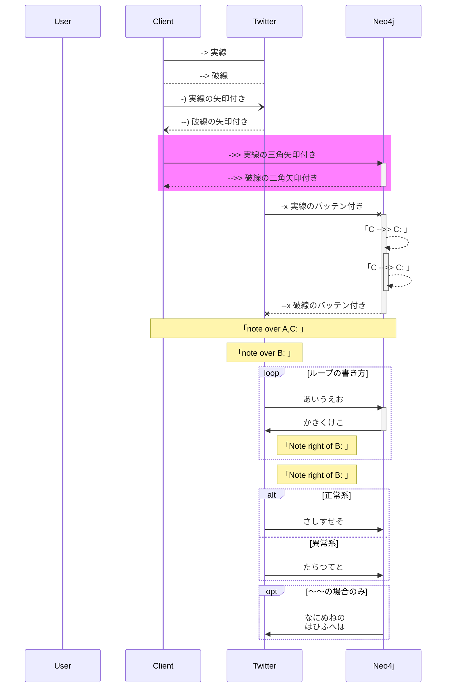

## 動機
- １ノードに対してCRUDする
- 1:多のノードを作成し、グループに対して全体に操作する

こういうふうに書く
https://codesandbox.io/s/force-directed-clusters-ovz1b

そのためには、クラスタIDとノードIDを１：多で紐づけて表示させる。
ノードの特徴をどのように捉えるかは、ここでは省く

クラスタIDとノードIDが紐づいたら
エッジとノードの連結を行う。

クラスタノードを作る場合一般的に

