## 動機
- １ノードに対してCRUDする
- 1:多のノードを作成し、グループに対して全体に操作する

こういうふうに書く
https://codesandbox.io/s/force-directed-clusters-ovz1b

そのためには、クラスタIDとノードIDを１：多で紐づけて表示させる。
ノードの特徴をどのように捉えるかは、ここでは省く

クラスタIDとノードIDが紐づいたら
エッジとノードの連結を行う。

クラスタノードを作る場合一般的に

```mermaid
sequenceDiagram
    participant User
    participant A as Client
    participant B as Twitter
    participant C as Neo4j

    A  ->  B: -> 実線
    B -->  A: --> 破線

    A  -)  B: -) 実線の矢印付き
    B --)  A: --) 破線の矢印付き

    rect rgba(255, 0, 255, 0.5)
        A  ->> C: ->> 実線の三角矢印付き
        activate C
        C -->> A: -->> 破線の三角矢印付き
        deactivate C
    end

    B  -x+  C: -x 実線のバッテン付き
    C -->>+ C: 「C -->> C: 」
    C -->>- C: 「C -->> C: 」
    C --x-  B: --x 破線のバッテン付き


    note over A,C: 「note over A,C: 」
    note over B: 「note over B: 」

    loop ループの書き方
        B  ->> C: あいうえお
        activate C
        C  ->> B: かきくけこ
        deactivate C
        note right of B: 「Note right of B: 」
    end
    note right of B: 「Note right of B: 」

    alt 正常系
        B  ->> C: さしすせそ
    else 異常系
        B  ->> C: たちつてと
    end

    opt 〜〜の場合のみ
        C  ->> B: なにぬねの<br/>はひふへほ
    end
```

twitter mass unfllow
